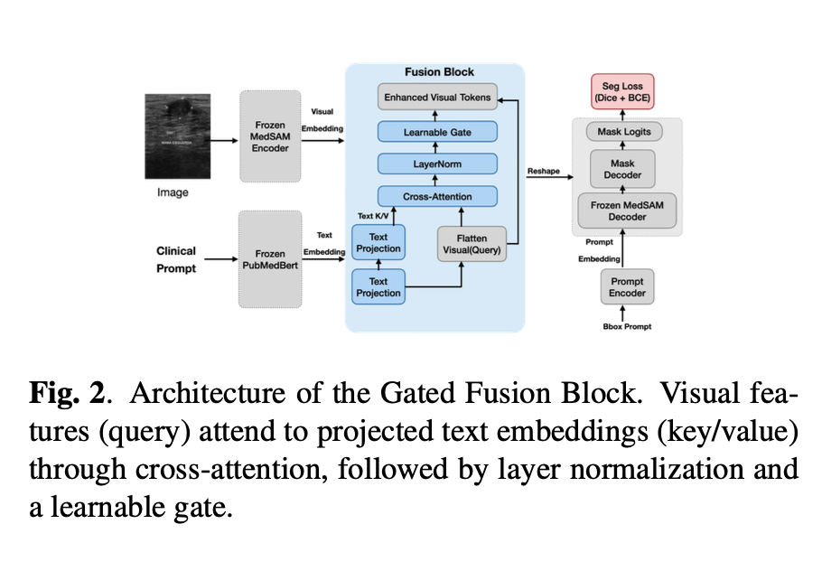
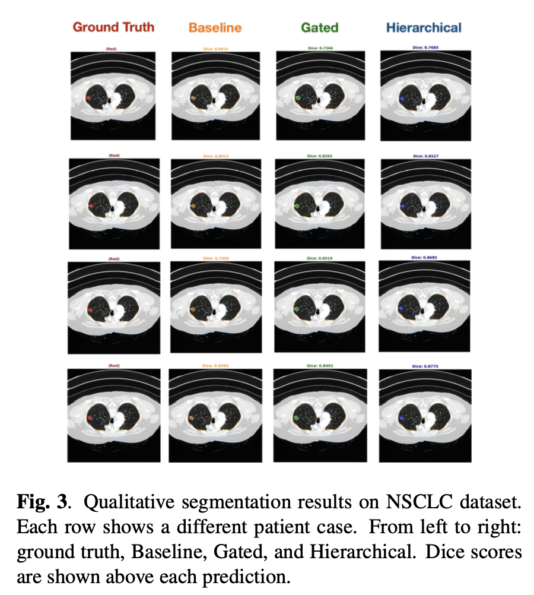
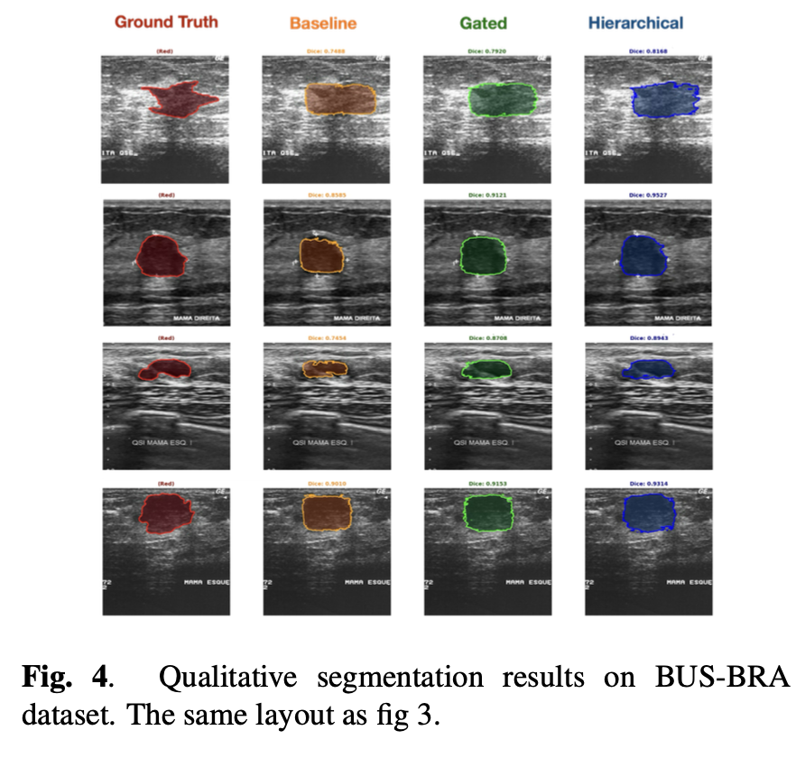

# Talk2MedSAM: A Hierarchical Multi-Modal Fusion Adapter for Medical Image Segmentation

[](https://www.python.org/downloads/)
[](https://pytorch.org/)

A lightweight hierarchical multi-modal fusion adapter that enables clinical text guidance for medical image segmentation using MedSAM.

## Overview

Talk2MedSAM integrates clinical text information into MedSAM for improved medical image segmentation. The model uses a hierarchical fusion mechanism that separately processes coarse-grained and fine-grained semantic information from clinical text while keeping pre-trained encoders frozen.

### Key Features

- **Hierarchical Fusion Architecture**: Separate pathways for global diagnostic context and local morphological details
- **Parameter-Efficient**: Only ~500K trainable parameters with frozen encoders
- **Multi-Modal Learning**: Combines visual features with clinical text guidance using contrastive learning
- **Validated Performance**: Tested on breast ultrasound (BUS-BRA) and lung CT (NSCLC) datasets

## Model Architecture

<p align="center">
  
</p>


### Hierarchical Fusion Block

The fusion module operates at two semantic levels:

**Level 1: Coarse-Grained Semantic Fusion**
- Single text token projection
- 4-head multi-head attention
- Captures global diagnostic information
- Learnable gate initialized to 0.5

**Level 2: Fine-Grained Semantic Fusion**
- Two text tokens for richer representation
- 8-head multi-head attention
- Captures local morphological details
- Learnable gate initialized to 0.8

### Training Objective
```
L_total = L_seg + λ * L_contrastive

where:
  L_seg = L_dice + L_BCE
  λ = 2 (contrastive weight)
```

## Results

### Segmentation Performance
<p align="center">
  
</p>

<p align="center">
  
</p>

| Dataset | Model | Dice ↑ | IoU ↑ | Improvement |
|---------|-------|--------|-------|-------------|
| **BUS-BRA** | Baseline (MedSAM) | 0.7945 ± 0.0780 | 0.6655 ± 0.1008 | - |
| | Gated Fusion | 0.8951 ± 0.0412 | 0.8126 ± 0.0652 | +12.67% |
| | **Hierarchical Fusion** | **0.9131 ± 0.0348** | **0.8419 ± 0.0562** | **+14.93%** |
| **NSCLC** | Baseline (MedSAM) | 0.8025 ± 0.0574 | 0.6738 ± 0.0781 | - |
| | Gated Fusion | 0.8272 ± 0.0610 | 0.7097 ± 0.0864 | +3.1% |
| | **Hierarchical Fusion** | **0.8581 ± 0.0525** | **0.7450 ± 0.0950** | **+6.9%** |

### Counterfactual Validation

Performance drop when using incorrect clinical text (validates that the model uses text information):

| Dataset | Condition | Mean Dice | Drop from Correct |
|---------|-----------|-----------|-------------------|
| **BUS-BRA** | Correct prompts | 0.8951 | - |
| | Wrong BI-RADS | 0.8873 | -0.88% |
| **NSCLC** | Correct prompts | 0.8581 | - |
| | Wrong T-stage | 0.8356 | -2.61% |
| | Wrong Histology | 0.8386 | -2.25% |
| | Both Wrong | 0.8384 | -2.27% |

## Installation
```bash
# Clone the repository
git clone https://github.com/AriaZhang522/Talk2MedSAM.git
cd Talk2MedSAM

# Create conda environment
conda create -n talk2medsam python=3.8
conda activate talk2medsam

# Install dependencies
pip install torch torchvision
pip install transformers
pip install monai
pip install opencv-python
pip install scikit-image
```

## Datasets

### BUS-BRA Dataset
- 1,875 breast ultrasound images from 1,064 patients
- BI-RADS categories 2-5
- Clinical text prompts based on BI-RADS morphological descriptions

### NSCLC-Radiogenomics Dataset
- 96 patients with complete T-stage and histological annotations
- 435 2D image-mask pairs (2.5D approach: 3 consecutive slices)
- Clinical text prompts from tumor stage and histological subtype


## Project Structure
```
Talk2MedSAM/
├── models/
│   ├── hierarchical_fusion.py    # Hierarchical fusion module
│   ├── gated_fusion.py           # Baseline gated fusion
│   └── text_encoder.py           # PubMedBERT encoder
├── data/
│   ├── bus_bra_dataset.py        # BUS-BRA dataloader
│   └── nsclc_dataset.py          # NSCLC dataloader
├── training/
│   ├── train.py                  # Training script
│   └── losses.py                 # Loss functions
├── evaluation/
│   ├── evaluate.py               # Evaluation metrics
│   └── counterfactual.py         # Counterfactual validation
└── configs/
    ├── bus_bra_config.yaml
    └── nsclc_config.yaml
```

## Citation

If you find this work useful, please cite:
```bibtex
@article{zhang2024talk2medsam,
  title={Talk2MedSAM: A Hierarchical Multi-Modal Fusion Adapter for Medical Image Segmentation Under Clinical Text Guidance},
  author={Zhang, Yuyan},
  journal={BME 590 Final Project Report},
  year={2024},
  institution={Duke University}
}
```

## Acknowledgments

- Built upon [MedSAM](https://github.com/bowang-lab/MedSAM)
- Text encoder: [PubMedBERT](https://huggingface.co/microsoft/BiomedNLP-PubMedBERT-base-uncased-abstract-fulltext)
- Datasets: [BUS-BRA](https://scholar.cu.edu.eg/?q=afahmy/pages/dataset), [NSCLC-Radiogenomics](https://doi.org/10.7937/K9/TCIA.2015.L3O0GTJA)
